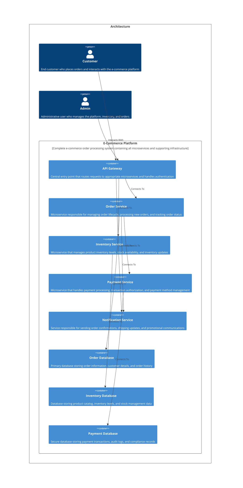

# Welcome to CALM Documentation

This documentation is generated from the **CALM Architecture-as-Code** model.

## High Level Architecture

## Nodes
    - [Customer](nodes/customer)
    - [Admin](nodes/admin)
    - [API Gateway](nodes/api-gateway)
    - [Order Service](nodes/order-service)
    - [Inventory Service](nodes/inventory-service)
    - [Payment Service](nodes/payment-service)
    - [Order Database](nodes/order-database)
    - [Inventory Database](nodes/inventory-database)
    - [Payment Database](nodes/payment-database)
    - [Notification Service](nodes/notification-service)
    - [E-Commerce Platform](nodes/ecommerce-platform)

## Relationships
    - [Customer Interacts Platform](relationships/customer-interacts-platform)
    - [Admin Interacts Platform](relationships/admin-interacts-platform)
    - [Gateway To Order Service](relationships/gateway-to-order-service)
    - [Gateway To Inventory Service](relationships/gateway-to-inventory-service)
    - [Order Service To Database](relationships/order-service-to-database)
    - [Order Service To Payment Service](relationships/order-service-to-payment-service)
    - [Inventory Service To Database](relationships/inventory-service-to-database)
    - [Payment Service To Database](relationships/payment-service-to-database)
    - [Order Service To Notification](relationships/order-service-to-notification)
    - [Gateway To Notification Service](relationships/gateway-to-notification-service)
    - [Platform Composition](relationships/platform-composition)

## Flows
     _No flows defined._

## Controls
  _No Controls defined._

## Metadata
  

      <table>
          <thead>
          <tr>
              <th>Key</th>
              <th>Value</th>
          </tr>
          </thead>
          <tbody>
          <tr>
              <td>
                  <b>Owner</b>
              </td>
              <td>
                  matt@rocketstack.co
                      </td>
          </tr>
          <tr>
              <td>
                  <b>Version</b>
              </td>
              <td>
                  1.0.0
                      </td>
          </tr>
          <tr>
              <td>
                  <b>Created</b>
              </td>
              <td>
                  2025-11-17
                      </td>
          </tr>
          <tr>
              <td>
                  <b>Description</b>
              </td>
              <td>
                  E-commerce order processing platform
                      </td>
          </tr>
          <tr>
              <td>
                  <b>Tags</b>
              </td>
              <td>
                  <ul>
                      <li>ecommerce</li>
                      <li>microservices</li>
                      <li>orders</li>
                  </ul>
              </td>
          </tr>
          </tbody>
      </table>
  

## Adrs
  _No Adrs defined._
