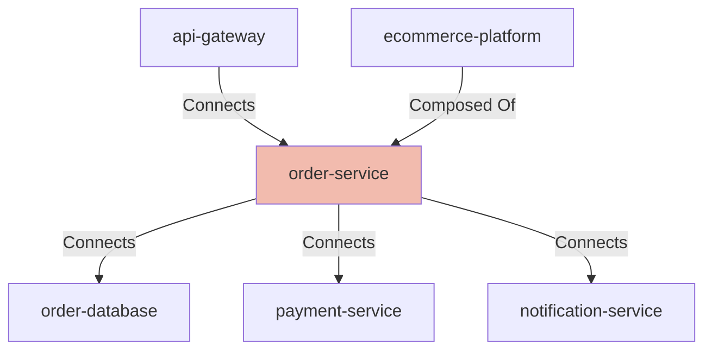

## Details

| Field               | Value                    |
|---------------------|--------------------------|
| **Unique ID**       | order-service                   |
| **Node Type**       | service             |
| **Name**            | Order Service                 |
| **Description**     | Microservice responsible for managing order lifecycle, processing new orders, and tracking order status          |

## Interfaces
        

            <table>
                <thead>
                <tr>
                    <th>Key</th>
                    <th>Value</th>
                </tr>
                </thead>
                <tbody>
                <tr>
                    <td>
                        <b>UniqueId</b>
                    </td>
                    <td>
                        order-api
                            </td>
                </tr>
                <tr>
                    <td>
                        <b>AdditionalProperties</b>
                    </td>
                    <td>
                        

                            <table>
                                <thead>
                                <tr>
                                    <th>Key</th>
                                    <th>Value</th>
                                </tr>
                                </thead>
                                <tbody>
                                <tr>
                                    <td>
                                        <b>Host</b>
                                    </td>
                                    <td>
                                        order-service.internal
                                            </td>
                                </tr>
                                <tr>
                                    <td>
                                        <b>Port</b>
                                    </td>
                                    <td>
                                        8080
                                            </td>
                                </tr>
                                </tbody>
                            </table>
                        

                    </td>
                </tr>
                </tbody>
            </table>
        

        

            <table>
                <thead>
                <tr>
                    <th>Key</th>
                    <th>Value</th>
                </tr>
                </thead>
                <tbody>
                <tr>
                    <td>
                        <b>UniqueId</b>
                    </td>
                    <td>
                        order-health
                            </td>
                </tr>
                <tr>
                    <td>
                        <b>AdditionalProperties</b>
                    </td>
                    <td>
                        

                            <table>
                                <thead>
                                <tr>
                                    <th>Key</th>
                                    <th>Value</th>
                                </tr>
                                </thead>
                                <tbody>
                                <tr>
                                    <td>
                                        <b>Host</b>
                                    </td>
                                    <td>
                                        order-service.internal
                                            </td>
                                </tr>
                                <tr>
                                    <td>
                                        <b>Port</b>
                                    </td>
                                    <td>
                                        8080
                                            </td>
                                </tr>
                                <tr>
                                    <td>
                                        <b>Path</b>
                                    </td>
                                    <td>
                                        /actuator/health
                                            </td>
                                </tr>
                                </tbody>
                            </table>
                        

                    </td>
                </tr>
                </tbody>
            </table>
        

        

            <table>
                <thead>
                <tr>
                    <th>Key</th>
                    <th>Value</th>
                </tr>
                </thead>
                <tbody>
                <tr>
                    <td>
                        <b>UniqueId</b>
                    </td>
                    <td>
                        order-metrics
                            </td>
                </tr>
                <tr>
                    <td>
                        <b>AdditionalProperties</b>
                    </td>
                    <td>
                        

                            <table>
                                <thead>
                                <tr>
                                    <th>Key</th>
                                    <th>Value</th>
                                </tr>
                                </thead>
                                <tbody>
                                <tr>
                                    <td>
                                        <b>Host</b>
                                    </td>
                                    <td>
                                        order-service.internal
                                            </td>
                                </tr>
                                <tr>
                                    <td>
                                        <b>Port</b>
                                    </td>
                                    <td>
                                        8080
                                            </td>
                                </tr>
                                <tr>
                                    <td>
                                        <b>Path</b>
                                    </td>
                                    <td>
                                        /actuator/prometheus
                                            </td>
                                </tr>
                                </tbody>
                            </table>
                        

                    </td>
                </tr>
                </tbody>
            </table>
        

## Related Nodes

## Controls
    _No controls defined._

## Metadata
  

      <table>
          <thead>
          <tr>
              <th>Key</th>
              <th>Value</th>
          </tr>
          </thead>
          <tbody>
          <tr>
              <td>
                  <b>Owner</b>
              </td>
              <td>
                  Order Team
                      </td>
          </tr>
          <tr>
              <td>
                  <b>Repository</b>
              </td>
              <td>
                  https://github.com/company/order-service
                      </td>
          </tr>
          <tr>
              <td>
                  <b>Deployment Type</b>
              </td>
              <td>
                  container
                      </td>
          </tr>
          <tr>
              <td>
                  <b>Sla Tier</b>
              </td>
              <td>
                  tier-1
                      </td>
          </tr>
          <tr>
              <td>
                  <b>Business Criticality</b>
              </td>
              <td>
                  high
                      </td>
          </tr>
          <tr>
              <td>
                  <b>Data Classification</b>
              </td>
              <td>
                  confidential
                      </td>
          </tr>
          <tr>
              <td>
                  <b>Runtime</b>
              </td>
              <td>
                  Java 17
                      </td>
          </tr>
          <tr>
              <td>
                  <b>Framework</b>
              </td>
              <td>
                  Spring Boot
                      </td>
          </tr>
          </tbody>
      </table>
  

