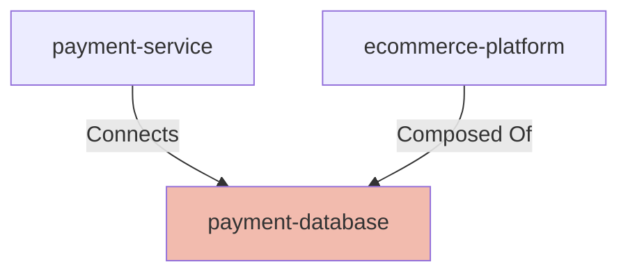

## Details

| Field               | Value                    |
|---------------------|--------------------------|
| **Unique ID**       | payment-database                   |
| **Node Type**       | database             |
| **Name**            | Payment Database                 |
| **Description**     | Secure database storing payment transactions, audit logs, and compliance records          |

## Interfaces
        

            <table>
                <thead>
                <tr>
                    <th>Key</th>
                    <th>Value</th>
                </tr>
                </thead>
                <tbody>
                <tr>
                    <td>
                        <b>UniqueId</b>
                    </td>
                    <td>
                        payment-db-connection
                            </td>
                </tr>
                <tr>
                    <td>
                        <b>AdditionalProperties</b>
                    </td>
                    <td>
                        

                            <table>
                                <thead>
                                <tr>
                                    <th>Key</th>
                                    <th>Value</th>
                                </tr>
                                </thead>
                                <tbody>
                                <tr>
                                    <td>
                                        <b>Host</b>
                                    </td>
                                    <td>
                                        payment-db.internal
                                            </td>
                                </tr>
                                <tr>
                                    <td>
                                        <b>Port</b>
                                    </td>
                                    <td>
                                        5434
                                            </td>
                                </tr>
                                </tbody>
                            </table>
                        

                    </td>
                </tr>
                </tbody>
            </table>
        

## Related Nodes

## Controls
    _No controls defined._

## Metadata
  

      <table>
          <thead>
          <tr>
              <th>Key</th>
              <th>Value</th>
          </tr>
          </thead>
          <tbody>
          <tr>
              <td>
                  <b>Compliance</b>
              </td>
              <td>
                  <ul>
                      <li>PCI-DSS</li>
                      <li>SOX</li>
                  </ul>
              </td>
          </tr>
          <tr>
              <td>
                  <b>Encryption</b>
              </td>
              <td>
                  AES-256
                      </td>
          </tr>
          <tr>
              <td>
                  <b>Backup Frequency</b>
              </td>
              <td>
                  continuous
                      </td>
          </tr>
          <tr>
              <td>
                  <b>Retention Period</b>
              </td>
              <td>
                  7-years
                      </td>
          </tr>
          </tbody>
      </table>
  

