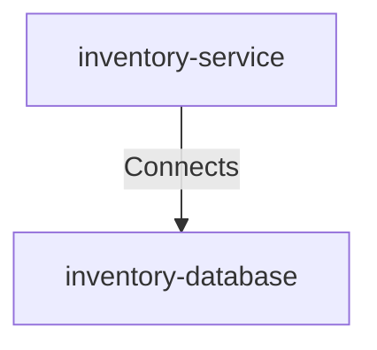

## Details

| Field               | Value                    |
|---------------------|--------------------------|
| **Unique ID**       | inventory-service-to-database                   |
| **Description**      |  Inventory Service connects to Inventory Database to manage stock levels and product information   |

## Related Nodes

## Controls
    _No controls defined._

## Metadata
  

      <table>
          <thead>
          <tr>
              <th>Key</th>
              <th>Value</th>
          </tr>
          </thead>
          <tbody>
          <tr>
              <td>
                  <b>Connection Pool Size</b>
              </td>
              <td>
                  15
                      </td>
          </tr>
          <tr>
              <td>
                  <b>Connection Timeout</b>
              </td>
              <td>
                  5s
                      </td>
          </tr>
          <tr>
              <td>
                  <b>Read Replica</b>
              </td>
              <td>
                  true
                      </td>
          </tr>
          <tr>
              <td>
                  <b>Monitoring</b>
              </td>
              <td>
                  true
                      </td>
          </tr>
          </tbody>
      </table>
  

