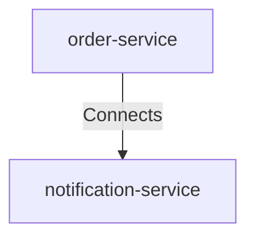

## Details

| Field               | Value                    |
|---------------------|--------------------------|
| **Unique ID**       | order-service-to-notification                   |
| **Description**      |  Order Service connects to Notification Service to send order confirmations and updates   |

## Related Nodes

## Controls
    _No controls defined._

## Metadata
  

      <table>
          <thead>
          <tr>
              <th>Key</th>
              <th>Value</th>
          </tr>
          </thead>
          <tbody>
          <tr>
              <td>
                  <b>Async Pattern</b>
              </td>
              <td>
                  fire-and-forget
                      </td>
          </tr>
          <tr>
              <td>
                  <b>Retry Policy</b>
              </td>
              <td>
                  exponential-backoff
                      </td>
          </tr>
          <tr>
              <td>
                  <b>Timeout</b>
              </td>
              <td>
                  5s
                      </td>
          </tr>
          </tbody>
      </table>
  

