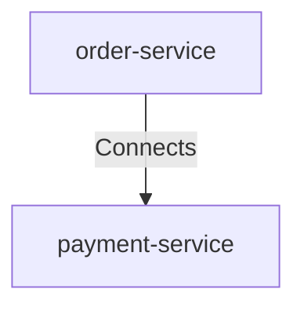

## Details

| Field               | Value                    |
|---------------------|--------------------------|
| **Unique ID**       | order-service-to-payment-service                   |
| **Description**      |  Order Service connects to Payment Service to process payments for confirmed orders   |

## Related Nodes

## Controls
    _No controls defined._

## Metadata
  

      <table>
          <thead>
          <tr>
              <th>Key</th>
              <th>Value</th>
          </tr>
          </thead>
          <tbody>
          <tr>
              <td>
                  <b>Circuit Breaker</b>
              </td>
              <td>
                  true
                      </td>
          </tr>
          <tr>
              <td>
                  <b>Timeout</b>
              </td>
              <td>
                  10s
                      </td>
          </tr>
          <tr>
              <td>
                  <b>Retry Attempts</b>
              </td>
              <td>
                  3
                      </td>
          </tr>
          <tr>
              <td>
                  <b>Sla</b>
              </td>
              <td>
                  &lt; 2s p95
                      </td>
          </tr>
          </tbody>
      </table>
  

